# DatabaseMastery Transport — Transp Lojistik

## Proje hakkında

DatabaseMastery Transport, ASP.NET Core MVC ve MongoDB ile geliştirilmiş eğitim amaçlı bir lojistik yönetimi uygulamasıdır. Proje; yönetim panelindeki gönderi ve kargo hareketi işlemlerini, kullanıcıya açık kargo takip ekranını ve MongoDB içindeki gömülü takip hareketleri yapısını örnekler.

## Kullanılan teknolojiler

- .NET 10 ve ASP.NET Core MVC
- MongoDB, MongoDB C# Driver ve BSON
- AutoMapper
- Razor Views ve ViewComponents
- Bootstrap, HTML, CSS ve JavaScript

## Özellikler

- Gönderiler için yönetim paneli CRUD işlemleri
- Gönderiye bağlı takip hareketlerini ekleme, listeleme, güncelleme ve silme
- `/Tracking/Index/` adresinde GET tabanlı public kargo sorgulama ve zaman çizelgesi
- Gönderi verilerinden üretilen ana sayfa istatistik bölümü
- Hizmet, ağırlık, adet ve ek seçeneklere göre istemci tarafında tahmini nakliye maliyeti hesaplama
- Ana sayfa içeriklerinin Razor ViewComponent yapısıyla sunulması

## Projeyi çalıştırma

Gereksinimler:

- .NET 10 SDK
- Erişilebilir bir MongoDB kurulumu

MongoDB bağlantısını ve veritabanı adını yerel, güvenli bir yapılandırma sağlayıcısıyla `DatabaseSettings:ConnectionString` ve `DatabaseSettings:DatabaseName` anahtarlarına verin. Örneğin PowerShell ortam değişkenleri kullanılabilir:

```powershell
$env:DatabaseSettings__ConnectionString = "<MongoDB bağlantınız>"
$env:DatabaseSettings__DatabaseName = "<veritabanı-adınız>"
```

Repository kökünde aşağıdaki komutları çalıştırın:

```powershell
dotnet restore .\DatabaseMastery.TransportMongoDb.csproj
dotnet build .\DatabaseMastery.TransportMongoDb.csproj --no-restore
dotnet run --project .\DatabaseMastery.TransportMongoDb.csproj
```

Gerçek bağlantı bilgilerini veya parolaları repository’ye eklemeyin.

## Ekran görüntüleri

### Ana sayfa

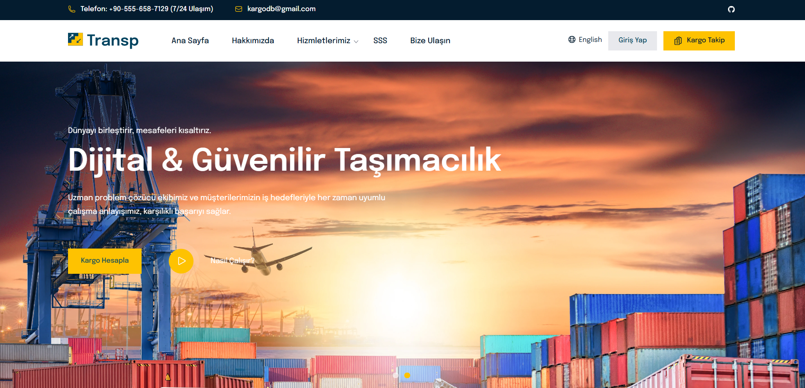
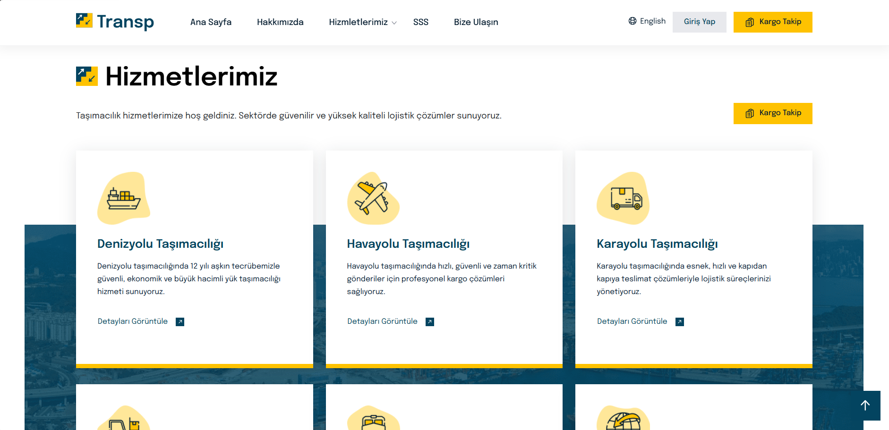

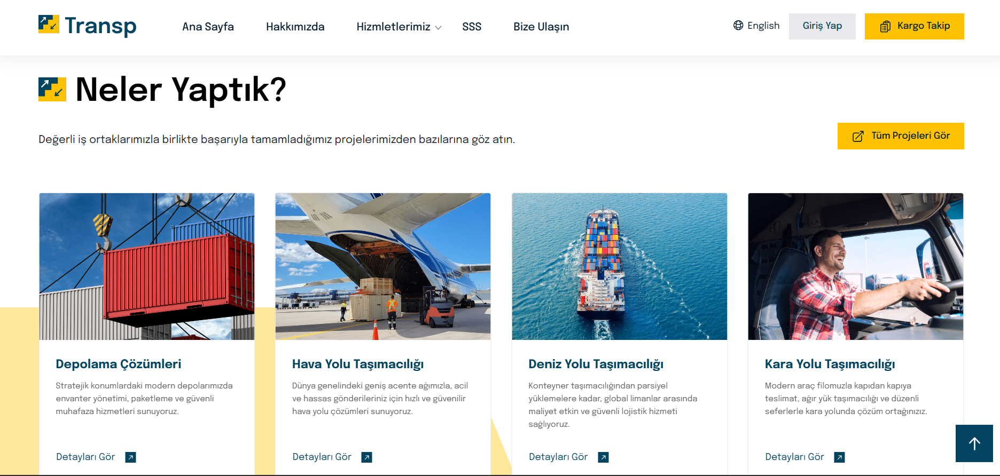
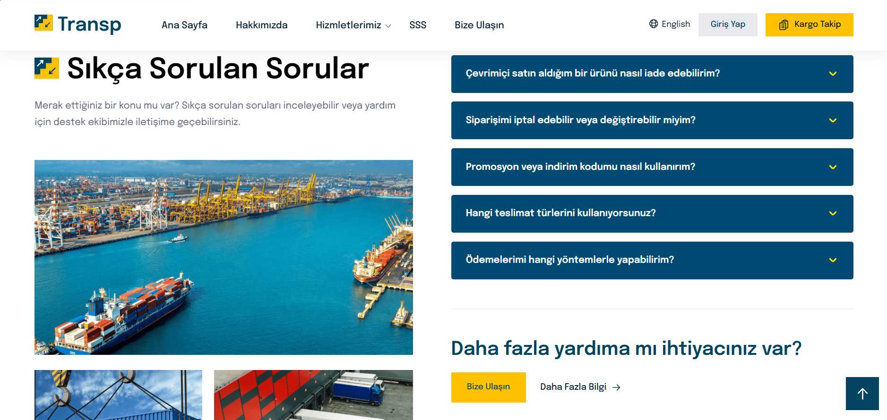
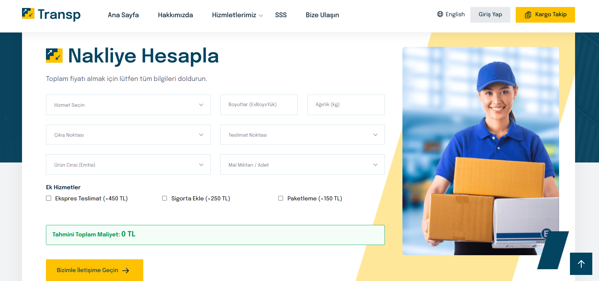

### Kargo takip

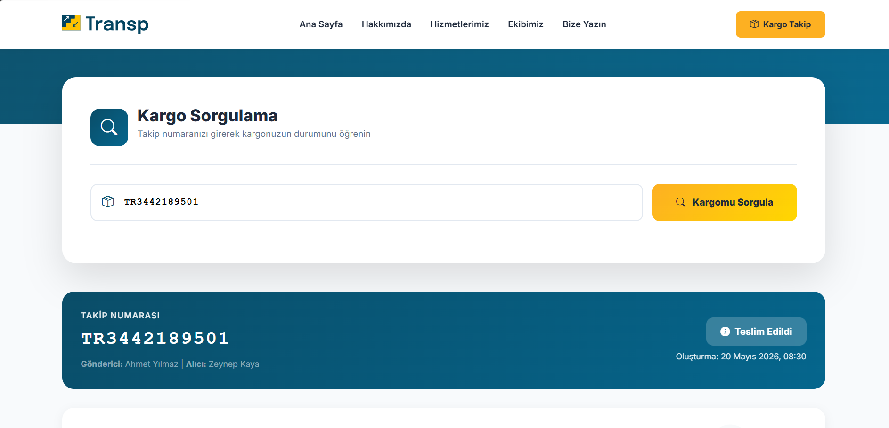
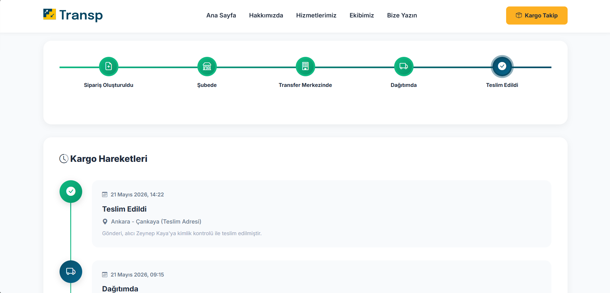
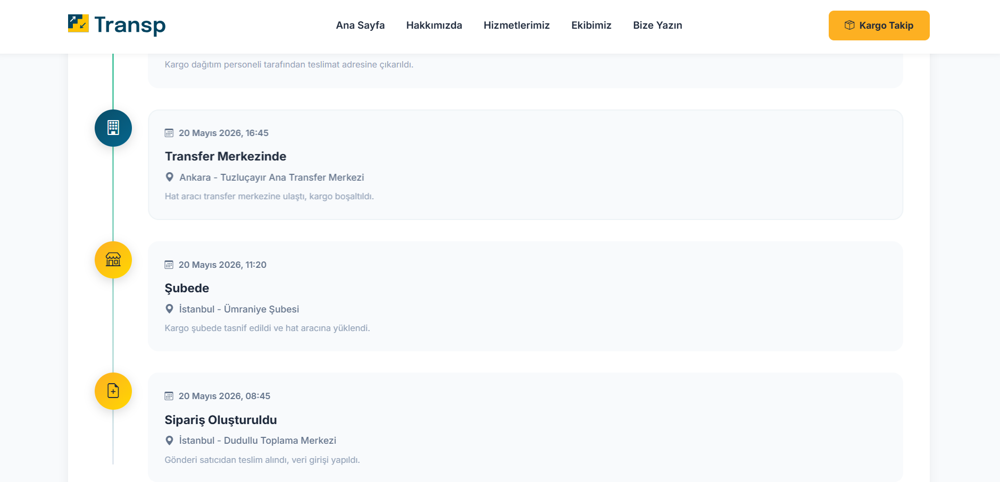

### Yönetim paneli

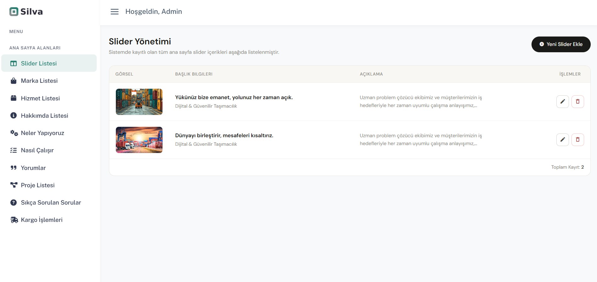
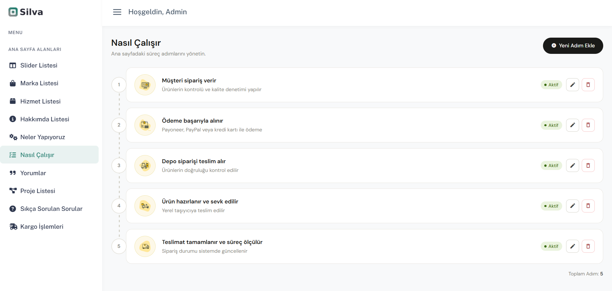
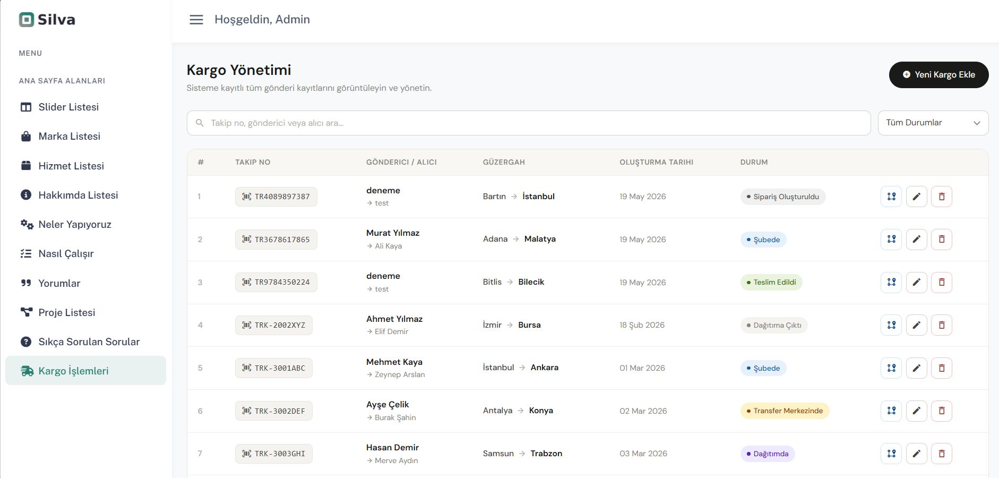
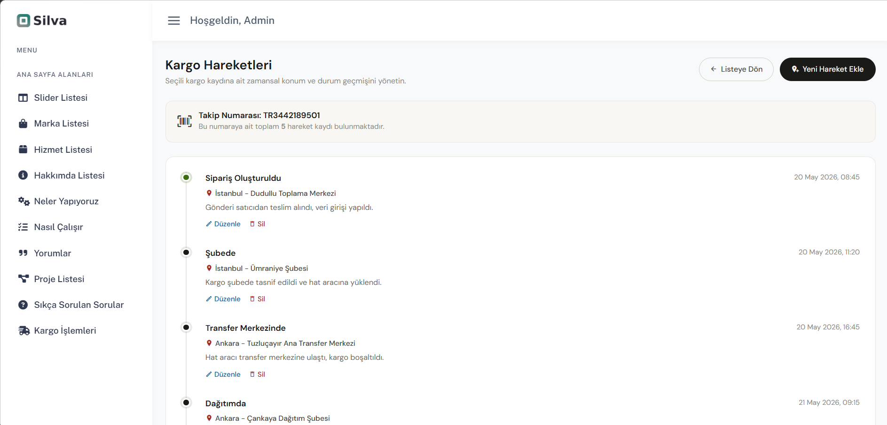
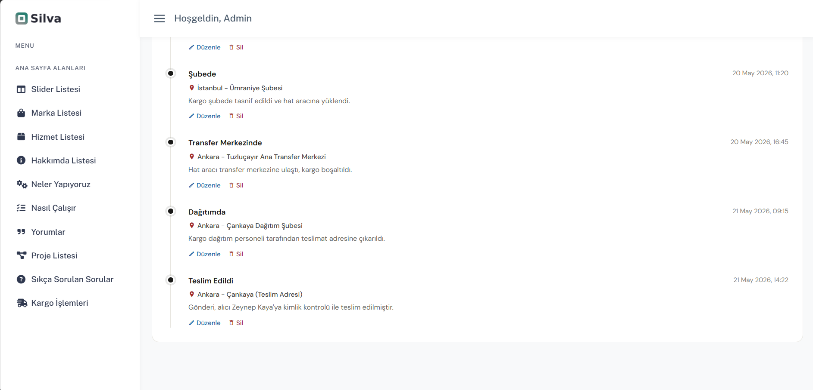
